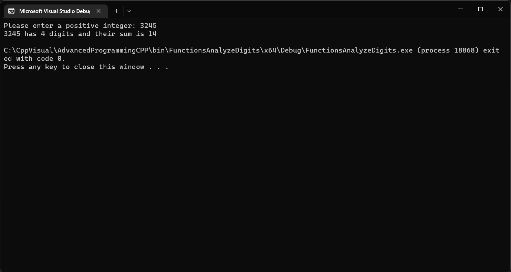

## Number of digits and their sum.

***Task text from the author:***
```
Write a program that read a positive integer num, and prints
the number of digits in num and their sum.

```
***Screenshots of running program in the console:***


