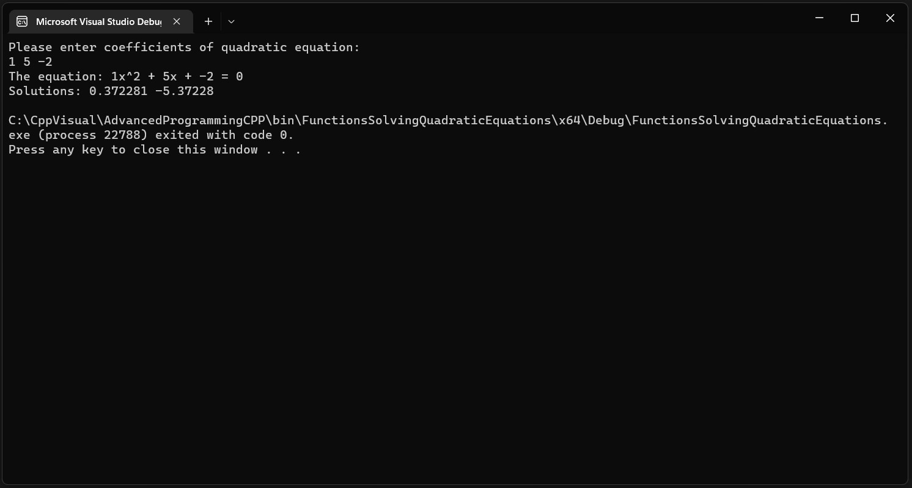

## Quadratic equation.

***Task text from the author:***
```
Write a program that reads 3 real numbers,
representing coefficients of a quadratic equation, and prints the solutions of the equation, 
if there are any, or an appropriate message.
Input from user: 3 real numbers, representing coefficients of quadratic equation
Output to user: The solutions of the equation, if there are any, or an appropriate message

```
***Screenshots of running program in the console:***


