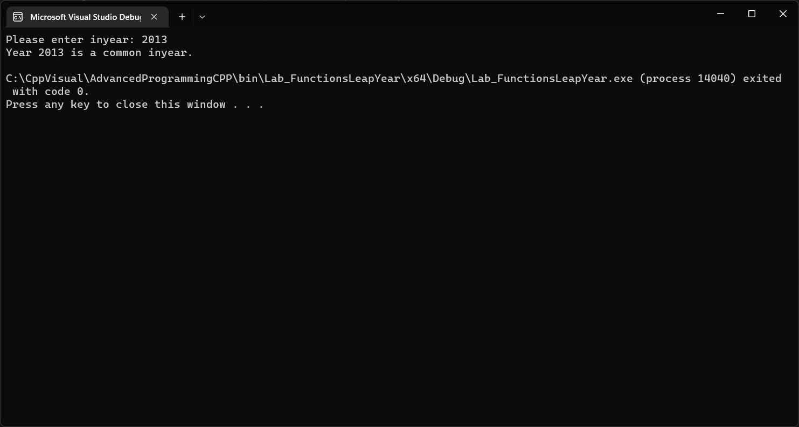

## Lab - Leap Year.

***Task text from the author:***
```
Write a function for determining if a year is a leap year in the Gregorian calendar.
The system is to check if it is divisible by 4 but not by 100 unless it is also divisible
by 400.

For example, 1896, 1904, and 2000 were leap years but 1900 was not.
Write a function that takes in a year as input and returns True if the year is a leap
year, return False otherwise.

Note: background on leap year https ://en.wikipedia.org/wiki/Leap_year

The name of the function should be isleapyear and the function should take one parameter 
which is the year to test.Here is an example call to the function

	int mybirthyear = 2000

	If(isleapyear(mybirthyear)) {

		printf(“Year % i  was a leap year”, mybirthyear)

	}

File Name

isleapyearf.cpp

Function Signature

bool isleapyear(int inyear);

```
***Screenshots of running program in the console:***



